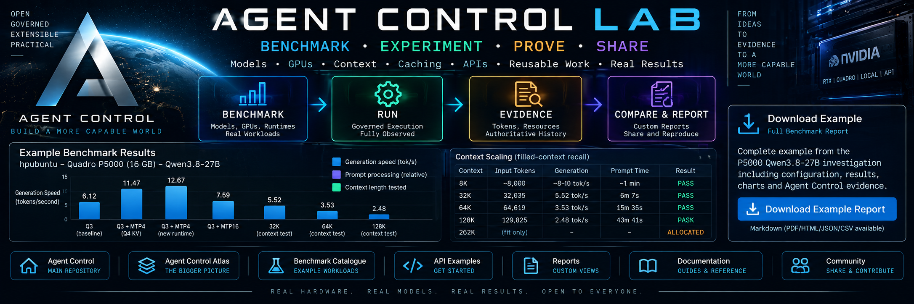
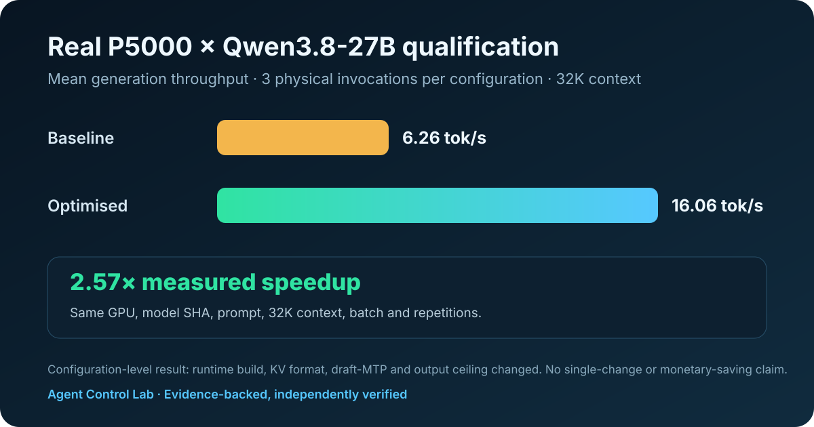

<p align="center">
  <a href="https://github.com/lozknowles/agent-control">Agent Control</a> ·
  <a href="https://github.com/lozknowles/agent-control#agent-control-atlas">Atlas</a> ·
  <a href="benchmarks/README.md">Benchmarks</a> ·
  <a href="experiments/README.md">Experiments</a> ·
  <a href="jobs/">Jobs</a> ·
  <a href="examples/README.md">API Examples</a> ·
  <a href="reports/README.md">Reports</a> ·
  <a href="docs/">Documentation</a>
</p>

# Agent Control Lab

**Benchmark · Experiment · Prove · Share**

**Agent Control Lab is the open experimentation and benchmarking companion to Agent Control. Run reusable workloads, qualify models and hardware, investigate optimisation techniques, and publish reproducible results backed by Agent Control evidence.**

**Real hardware. Real models. Real results.**

Want to know how fast a model is on your GPU, how much context really fits, whether a quantisation helps, which machine suits a workload, or whether somebody else can reproduce your result? Lab turns those questions into governed runs with measurements you can inspect and share.

## Example benchmark: Quadro P5000 × Qwen3.8-27B

<!-- BEGIN GENERATED EXAMPLE BENCHMARK -->
This first worked example is a real physical qualification on an **HP ZBook 17 G4 workstation** with an **Intel(R) Core(TM) i7-7700HQ CPU @ 2.80GHz**, **64 GiB RAM**, **NVIDIA Quadro P5000 (16 GiB)**, **Ubuntu 24.04.5 LTS**, and **CUDA 13.0 (driver-reported compatibility)**. It uses **llama.cpp** and the immutable **Qwen3.8-27B-Q3_K_M** model at **32K context**. Both configurations ran 3 times through successful Agent Control Work Parcels and passed independent verification.



| Measurement | Baseline | Optimised configuration |
|---|---:|---:|
| Mean prompt throughput | 115.99 tok/s | 109.98 tok/s |
| Mean generation throughput | 6.26 tok/s | 16.06 tok/s |
| Mean time to first token | 19.22 s | 20.26 s |
| Physical invocations | 3 | 3 |
| Independent verification | PASS | PASS |

The measured configuration-level generation-throughput result is **2.57× baseline**. The comparison keeps the GPU, model SHA-256, prompt, context, batch and repetitions fixed. Runtime build, KV format, draft-MTP and output ceiling changed, so Lab does **not** attribute the result to one optimisation or treat elapsed time as a like-for-like latency comparison.
<!-- END GENERATED EXAMPLE BENCHMARK -->

### Download the example benchmark report

**[Open the full example benchmark report](reports/p5000-qwen3.8-27b/report.md)**

[HTML](reports/p5000-qwen3.8-27b/report.html) · [Markdown](reports/p5000-qwen3.8-27b/report.md) · [JSON](reports/p5000-qwen3.8-27b/report.json) · [CSV](reports/p5000-qwen3.8-27b/report.csv) · [Source projection](reports/p5000-qwen3.8-27b/source-data.json) · [SHA-256 manifest](reports/p5000-qwen3.8-27b/manifest.json)

Every displayed value and chart coordinate is generated from the privacy-safe machine-readable evidence projection. The report retains Work Parcel, job-run, invocation, model, runtime, artefact and source-file identities. No monetary saving is claimed because the local backend supplied no authoritative monetary billing data.

## What you can do in the Lab

### Benchmarks

Qualify a real combination of:

`device × accelerator × runtime × model × configuration`

Lab reports can retain model and hardware identity, runtime and configuration, input/cached/output tokens, prompt and generation throughput, context, memory, utilisation, quality, failures and provenance. The objective is a reproducible result—not a leaderboard screenshot. [Explore benchmarks](benchmarks/README.md).

### Experiments

Investigate models, caching, context, routing, runtimes and optimisation techniques without turning an experiment into an unsupported product claim. Negative results and failed boundaries remain evidence. [Explore experiments](experiments/README.md).

### Jobs

Use the existing library of 50 reviewed, reusable Agent Control workloads and 12 qualification suites. Existing manifests, the `ac-jobs` CLI, package identity and commands remain compatible. [Browse Jobs](jobs/) or [the generated catalogue](catalogue/index.json).

### API examples

Inspect estate, context and qualification records, and see the current bounded Agent Control integration contract. [Browse API examples](examples/README.md).

### Reports

Publish evidence-backed Markdown, HTML, JSON and CSV projections with reproducible charts and immutable source hashes. [Browse reports](reports/README.md).

## Evidence model

```text
Benchmark / Experiment / Job
            ↓
       Agent Control
            ↓
       Governed Run
            ↓
        Invocations
            ↓
   Telemetry + Evidence
            ↓
   Compare / Report / Share
```

> **Evidence is authoritative. Reports and charts are projections over evidence.**

Lab does not introduce another orchestration engine or benchmark database. Agent Control remains authoritative for governance, execution, routing, telemetry and evidence. Generated Lab outputs are rebuildable views over retained evidence.

## Agent Control, Atlas and Lab

- **[Agent Control](https://github.com/lozknowles/agent-control)** governs and executes work.
- **[Atlas](https://github.com/lozknowles/agent-control#agent-control-atlas)** makes the execution estate and retained work navigable. Atlas is a public Agent Control surface in the same repository, not a separate orchestration system.
- **Agent Control Lab** provides reusable benchmarks, experiments, jobs, examples and reporting.

These are complementary surfaces over the Agent Control architecture.

## Start with the Job Library

Agent Control Lab currently retains the published **`agent-control-jobs`** package and repository slug for compatibility. Version **0.1.0** includes **50 canonical jobs**, related scenario variants, **12 suites**, a generated catalogue and a reference readiness evaluator. These are reviewed definitions and bounded acceptance cases, not 50 physically qualified agents. See [current evidence and limitations](docs/QUALIFICATION.md) and the [repository-name assessment](docs/REPOSITORY-NAME-ASSESSMENT.md).

> Presence in the Job Library does not grant execution authority.

Requires Git, Node.js 22 or newer and npm. Works on Linux and Windows. No model account is needed to inspect the library or run its tests.

```sh
git clone https://github.com/lozknowles/agent-control-jobs.git
cd agent-control-jobs
npm ci --ignore-scripts
npm run check
node tools/cli.mjs list
node tools/cli.mjs search gpu
node tools/cli.mjs inspect service-health-check
node tools/cli.mjs suite AC-QUAL-CORE
node tools/cli.mjs provenance inbox-triage
node tools/cli.mjs compatibility service-health-check examples/estate.json
```

The last command deliberately reports missing or stale prerequisites. The example estate grants no authority. A successful compatibility query has exit code 0 even when its result is BLOCKED; inspect the returned state.

Optional local CLI installation remains unchanged:

```sh
npm link --ignore-scripts
ac-jobs search gpu
```

To check the published catalogue or regenerate it after editing:

```sh
node tools/cli.mjs catalogue --check
npm run catalogue
```

To exercise a **fixture validator**, not an agent:

```sh
node tools/cli.mjs verify csv-analysis jobs/data/csv-analysis/expected/result.json
```

That validates a reference answer. It is a validator self-check, never qualification evidence. To test a worker, supply only its prompt and fixture input, then validate the independently produced result. Follow [the runner contract](docs/RUNNER.md).

## Find or create a useful job

[Browse the generated catalogue](catalogue/index.json), search with the CLI, or explore [Jobs](jobs/). `common_job: true` identifies useful starting points, including service and machine checks, model comparison, document extraction, research and resume.

The three high-level patterns are **Process Automation**, **Worker Augmentation** and **Enterprise Intelligence**. Domain categories and tags provide finer filtering. Operations, governance, recovery, multi-agent and qualification workloads exercise controller behaviour without turning each job into a bespoke agent graph.

Each job has a one-sentence objective, a manifest, a small acceptance fixture, expected facts and a declarative validator. More demanding execution belongs in adapters and the controller. [Create your first job](docs/CREATE-YOUR-FIRST-JOB.md) without learning Agent Control internals.

## Research, readiness and governance

The [research inventory](research/REAL-WORLD-USE-CASES.md) contains 34 selected records from 10 sources. [Methodology](research/METHODOLOGY.md) explains selection bias, overlap and the distinction between advertised architectures and observed deployments. [Traceability](research/USE-CASE-TRACEABILITY.md) connects records to workloads, requirements and suites; [coverage](research/COVERAGE.md) reports gaps as well as representation.

The evaluator compares job requirements with an explicit estate snapshot and scoped grant:

**READY / CONFIGURATION REQUIRED / CONNECTOR REQUIRED / CREDENTIAL REQUIRED / APPROVAL REQUIRED / UNSUPPORTED**. `BLOCKED` additionally covers stale or invalid evidence and operational holds.

All unmet reasons are retained. READY is advisory, never authority. A runtime must recheck the exact job digest, input digest, target, permissions, approval expiry, budget and observation freshness immediately before dispatch. [Readiness contract](docs/COMPATIBILITY.md).

Secrets stay in the controller's credential store. Downloads and community contributions are untrusted. Manifests declare reads, writes, deployments, service control, financial actions and communications explicitly. [Security and trust boundary](SECURITY.md).

## Qualification and integration

A refusal can pass when refusal is expected and evidence proves no unauthorised effect. Missing infrastructure is a blocked qualification attempt, not a pass. Suites retain their full denominator. [Qualification rules](docs/QUALIFICATION.md).

[The Agent Control integration proposal](docs/AGENT-CONTROL-INTEGRATION.md) is grounded in inspected implementation revisions. [Dashboard contract](docs/DASHBOARD-CONTRACT.md) supports browse, inspect, compatibility and qualification history. This repository does not install a dashboard or silently submit jobs.

## Reproduce the example report

The committed chart and downloads are deterministic outputs. To verify them:

```sh
npm run benchmark:example -- --check
```

Maintainers with the retained Agent Control qualification evidence can refresh the privacy-safe source projection and regenerate every report format:

```sh
npm run benchmark:example:import -- /path/to/qualification-evidence
npm run benchmark:example
```

The importer reads only the named evidence records, validates successful Work Parcels and independent verification, removes machine paths and raw prompts/outputs, and retains source SHA-256 values. See [benchmark methodology](benchmarks/README.md).

## Contribute

Small useful jobs, reproducible benchmark definitions, careful experiments and evidence-backed report tooling are welcome. Start with the [simple job template](templates/simple-job.yaml), then read [CONTRIBUTING.md](CONTRIBUTING.md).

CI checks manifests, references, checksums, permission consistency, fixtures, generated reports, tests, local links and common secret patterns. Static checks cannot prove a job safe or a benchmark physically valid.

Library, specification, jobs, suites and catalogue have independent versions. See [versioning](docs/VERSIONING.md). Code and original job definitions use the [MIT licence](LICENSE); external source documents retain their own rights and are not redistributed.
